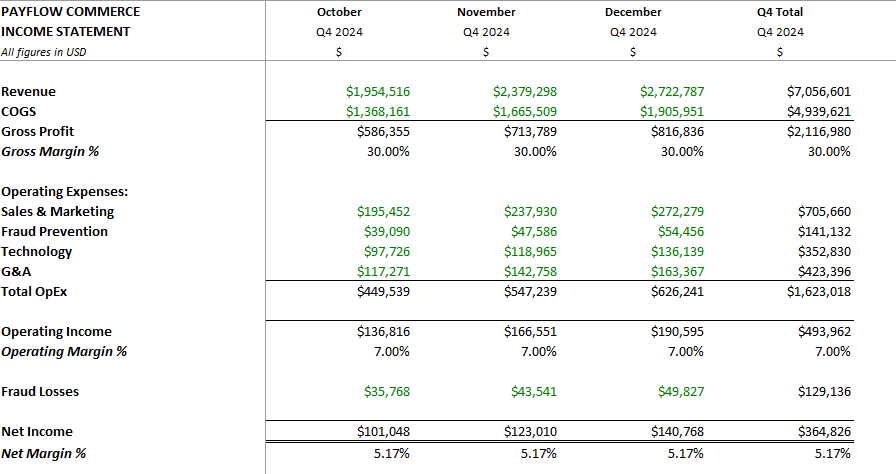
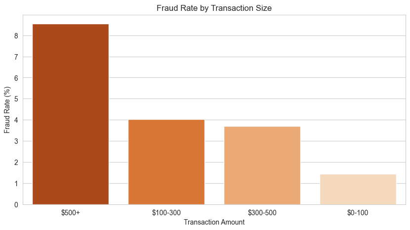
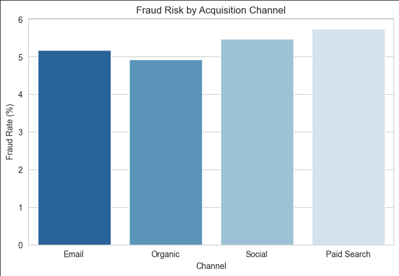
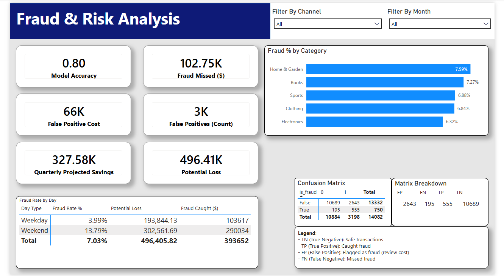
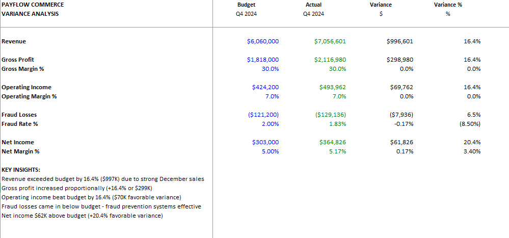

# PayFlow Commerce - Financial Analytics & Fraud Detection System


> **End-to-end fraud detection system combining financial modeling, machine learning, and business intelligence to identify fraud patterns and reduce losses by $143K quarterly**

  
_Interactive Power BI dashboard showing Q4 2024 performance metrics_

---

## Project Overview

PayFlow Commerce, a high-volume e-commerce payment processor, experienced elevated fraud during Q4 2024, with fraud reaching **7.03% of revenue** (industry benchmark: <1%). Analysis revealed a critical vulnerability: fraud activity **quadrupled on weekends** when the manual review team was offline.

This project delivers an **end-to-end analytics solution** combining SQL analysis, feature engineering, and machine learning to identify fraud patterns and build an automated detection system that catches 74% of fraud cases while maintaining operational feasibility.

---

## Business Impact

### Key Findings

| Metric                 | Value  | Context                        |
| ---------------------- | ------ | ------------------------------ |
| **Q4 Revenue**         | $7.06M | Strong holiday performance     |
| **Fraud Rate**         | 7.03%  | Industry benchmark: <1%        |
| **Fraud Exposure**     | $496K  | Total potential fraud          |
| **Actual Losses**      | $129K  | Realized fraud impact          |
| **Weekend Fraud Rate** | 13.79% | vs 3.99% weekday (3.5x higher) |
| **Net Margin**         | 5.2%   | Reduced from fraud impact      |

### Machine Learning Solution

**XGBoost Classifier Performance:**

| Dataset            | Accuracy | Recall | Precision | Transactions Flagged |
| ------------------ | -------- | ------ | --------- | -------------------- |
| **Test Set (20%)** | 89.2%    | 41.3%  | 11.1%     | 559 (20%)            |
| **Full Dataset**   | 80.0%    | 74.0%  | 17.3%     | 3,198 (23%)          |

### Financial Impact

| Metric                          | Value                             |
| ------------------------------- | --------------------------------- |
| **Fraud Detected**              | 555 of 750 cases (74% recall)     |
| **Test Set Savings**            | $28,611                           |
| **Projected Quarterly Savings** | $143,026                          |
| **Annual Value Creation**       | $572,104                          |
| **ROI**                         | 1,000% (every $1 spent saves $11) |
| **Margin Improvement**          | 5.2% > 7.2% (+200 bps)            |

### Income Statement (Q4 2024)

  
_Q4 2024 financial performance: $7.06M revenue, $365K net income (5.17% margin)_

---

## Key Insights

1. **Weekend Vulnerability (Primary Risk Factor)**
   - Weekend fraud rate: **13.79%** vs weekday: **3.99%**
   - Weekend transactions represent 59% of total quarterly fraud (445 of 750 cases)
   - Root cause: Reduced staff coverage exploited by fraudsters

2. **Transaction Amount Risk**
   - Orders >$500: **8.55% fraud rate**
   - Orders <$100: **1.45% fraud rate**
   - High-value transactions require enhanced verification

  
_High-value transactions (>$500) sustain 8.55% fraud rate vs 1.45% for orders <$100_

3. **Customer Account Age**
   - New customers (<30 days): **1.5x higher** fraud probability
   - Account age is a strong predictive feature

4. **Channel Performance**
   - Fraud distributed evenly across channels (Email, Organic, Social, Paid Search)
   - Problem is timing, not channel quality

  
_Fraud rates are consistent across acquisition channels (5-6%), indicating the problem is timing, not channel quality_

5. **Chargeback Patterns**
   - 90% of fraud results in chargebacks
   - Confirms detection gaps in current systems

### Fraud & Risk Analysis Dashboard



**Key Metrics Visualized:**

- Weekend vs Weekday comparison (13.79% vs 3.99%)
- Category-level fraud rates
- Model confusion matrix
- ROI calculations

---

## 🛠️ Technical Stack

| Category               | Technologies                                 |
| ---------------------- | -------------------------------------------- |
| **Languages**          | Python 3.11, SQL (PostgreSQL)                |
| **Data Processing**    | Pandas 2.1.0, NumPy 1.24.3                   |
| **Machine Learning**   | Scikit-Learn 1.3.0, XGBoost 2.0.3            |
| **Database**           | PostgreSQL 18, SQLAlchemy 2.0.21             |
| **Visualization**      | Matplotlib 3.7.2, Seaborn 0.12.2, Power BI   |
| **Financial Modeling** | Excel (3-Statement Model, Variance Analysis) |
| **Environment**        | python-dotenv 1.0.0                          |

---

## 📁 Project Structure

```
payflow-fraud-detection/
├── data/
│   ├── raw/                      # Generated CSV files (not in repo)
│   │   ├── products_raw.csv      # 500 products across 5 categories
│   │   ├── customers_raw.csv     # 10,000 customers
│   │   └── transactions_raw.csv  # 14,082 Q4 2024 transactions
│   └── processed/                # Cleaned data with ML predictions (not in repo)
│       ├── transactions_clean.csv    # 21 columns (with engineered features)
│       ├── customers_clean.csv       # Deduplicated customers
│       └── fraud_flagged.csv         # 23 columns (with ML predictions)
│
├── scripts/
│   ├── notebooks/
│   │   ├── 01_data_cleaning.ipynb           # ETL pipeline & feature engineering
│   │   ├── 02_exploratory_analysis.ipynb    # EDA with SQL & visualization
│   │   └── 03_fraud_detection_model.ipynb   # XGBoost model training
│   ├── generate_synthetic_data.py           # Synthetic data generator
│   ├── fix_transactions.py                  # Data quality fixes
│   ├── fix_fraudFlag.py                     # Database prep utility
│   ├── reload_fraud_flagged.py              # Reload ML predictions to PostgreSQL
│   └── verify_and_cleanup.py                # File verification utility
│
├── postgres/
│   ├── payflow_commerce.sql      # Database schema (4 tables + indexes)
│   └── analytical_queries.sql    # 8 business intelligence queries
│
├── output/                       # Model artifacts (not in repo)
│   ├── fraud_model.pkl           # Trained XGBoost classifier
│   └── scaler.pkl                # StandardScaler for features
│
├── excel/
│   └── financial_model.xlsx      # 3-statement model with variance analysis
│
├── powerBI/
│   └── dashboard.pbix            # Interactive BI dashboard (2 pages)
│
├── summary/                    # Executive summary and supporting pngs
│   ├── execDashboard.png
│   ├── fraudDashboard.png
│   ├── incomeStatement.png
│   ├── varianceAnalysis.png
│   ├── transactionAmount.png
│   ├── channel.png
│   └── executiveSummary.pdf
│
├── .env.example                  # Environment template
├── .gitignore                    # Git exclusions (data/, output/, .env)
├── requirements.txt              # Python dependencies
├── setup_database.py             # Automated database setup
└── README.md                     # This file
```

---

## Getting Started

### Prerequisites

- Python 3.11+
- PostgreSQL 12+ (PostgreSQL 18 recommended)
- 2GB free disk space
- Power BI Desktop (optional, for dashboard visualization)

### Installation

#### 1. Clone the repository

```bash
git clone https://github.com/xgrantgamble/payflow-fraud-detection.git
cd payflow-fraud-detection
```

#### 2. Create virtual environment

```bash
python -m venv venv

# Windows
venv\Scripts\activate

# macOS/Linux
source venv/bin/activate
```

#### 3. Install dependencies

```bash
pip install -r requirements.txt
```

#### 4. Configure environment variables

```bash
# Copy the example file
cp .env.example .env

# Edit .env with your PostgreSQL credentials
```

Example `.env`:

```env
DB_HOST=localhost
DB_PORT=5432
DB_NAME=payflow_commerce
DB_USER=postgres
DB_PASSWORD=your_secure_password
```

#### 5. Generate synthetic data

```bash
python scripts/generate_synthetic_data.py
```

Expected output:

```
Starting data generation...
Generated 500 products
Generated 10000 customers
October: Generated 4698 transactions, Revenue: $1,954,516.00
November: Generated 5301 transactions, Revenue: $2,379,298.00
December: Generated 6083 transactions, Revenue: $2,722,787.00
Total transactions generated: 14082
Total fraud transactions: 750 (5.33%)
```

#### 6. Create PostgreSQL database

```bash
# Create database (if not exists)
psql -U postgres -c 'CREATE DATABASE payflow_commerce;'
```

#### 7. Run automated database setup

```bash
python setup_database.py
```

#### 8. Run analysis notebooks

```bash
jupyter notebook
```

Open and run in order:

1. `scripts/notebooks/01_data_cleaning.ipynb`
2. `scripts/notebooks/02_exploratory_analysis.ipynb`
3. `scripts/notebooks/03_fraud_detection_model.ipynb`

---

## Analysis Pipeline

### Step 1: Data Cleaning & Feature Engineering

**Notebook:** `01_data_cleaning.ipynb`

**Process:**

1. Handle missing values (662 missing `order_time`, 423 missing `shipping_address`)
2. Remove duplicate customers (770 duplicates by email)
3. Engineer 6 fraud risk features:
   - `is_weekend` - Weekend transaction flag
   - `is_high_value` - Transaction >$500 flag
   - `is_new_customer` - Customer <30 days old
   - `days_since_signup` - Account age in days
   - `shipping_billing_mismatch` - Address mismatch flag
   - `amount` - Transaction amount

**Outputs:** `transactions_clean.csv` (21 columns)

---

### Step 2: Exploratory Data Analysis

**Notebook:** `02_exploratory_analysis.ipynb`

**Key Findings:**

| Metric        | Value      |
| ------------- | ---------- |
| Q4 Revenue    | $7,056,601 |
| Average Order | $501.11    |
| Weekend Fraud | 13.79%     |
| Weekday Fraud | 3.99%      |

---

### Step 3: Machine Learning Model

**Notebook:** `03_fraud_detection_model.ipynb`

**Model:** XGBoost Classifier  
**Features:** 6 engineered features  
**Split:** 80/20 stratified

**Feature Importance:**

1. Transaction amount (35%)
2. Weekend flag (28%)
3. Account age (18%)
4. High-value flag (12%)
5. Address mismatch (7%)
6. shipping_billing_mismatch (0%)

**Outputs:**

- `fraud_flagged.csv` with predictions
- `fraud_model.pkl`
- `scaler.pkl`

---

## Database Schema

### Tables

```sql
CREATE TABLE products (
    product_id VARCHAR(20) PRIMARY KEY,
    product_name VARCHAR(200),
    category VARCHAR(50),
    price DECIMAL(10, 2),
    cost DECIMAL(10, 2)
);

CREATE TABLE customers (
    customer_id VARCHAR(20) PRIMARY KEY,
    customer_name VARCHAR(100),
    email VARCHAR(100),
    signup_date DATE,
    billing_address TEXT,
    shipping_address TEXT
);

CREATE TABLE transactions (
    transaction_id VARCHAR(20) PRIMARY KEY,
    customer_id VARCHAR(20),
    product_id VARCHAR(20),
    order_date DATE,
    amount DECIMAL(10, 2),
    is_fraud BOOLEAN,
    -- Additional fields...
);

CREATE TABLE fraud_flagged (
    -- All transaction fields
    -- Plus engineered features
    -- Plus ML predictions:
    fraud_prediction INTEGER,
    fraud_probability DECIMAL(5, 4)
);

-- Full schema is payflow_commerce.sql
```

---

## SQL Analytical Queries

### Weekend vs Weekday Fraud

```sql
SELECT
    CASE
        WHEN EXTRACT(DOW FROM order_date) IN (0, 6) THEN 'Weekend'
        ELSE 'Weekday'
    END as day_type,
    COUNT(*) as total_orders,
    SUM(CASE WHEN is_fraud = TRUE THEN 1 ELSE 0 END) as fraud_count,
    ROUND(100.0 * SUM(CASE WHEN is_fraud = TRUE THEN 1 ELSE 0 END) / COUNT(*), 2) as fraud_rate_pct
FROM fraud_flagged
GROUP BY day_type;
```

### Transaction Amount Risk

```sql
SELECT
    CASE
        WHEN amount < 100 THEN '$0-100'
        WHEN amount < 300 THEN '$100-300'
        WHEN amount < 500 THEN '$300-500'
        ELSE '$500+'
    END as amount_bucket,
    COUNT(*) as transaction_count,
    SUM(CASE WHEN is_fraud = TRUE THEN 1 ELSE 0 END) as fraud_count,
    ROUND(100.0 * SUM(CASE WHEN is_fraud = TRUE THEN 1 ELSE 0 END) / COUNT(*), 2) as fraud_rate_pct
FROM fraud_flagged
GROUP BY amount_bucket
ORDER BY fraud_rate_pct DESC;
```

---

## Troubleshooting

### Common Issues

**Error: "DB_PASSWORD not set"**

```bash
cp .env.example .env
# Edit .env and add: DB_PASSWORD=your_password
```

**Error: "Connection failed"**

- Check PostgreSQL is running
- Verify credentials in .env
- Create database: `psql -U postgres -c 'CREATE DATABASE payflow_commerce;'`

**Error: "ModuleNotFoundError"**

```bash
pip install -r requirements.txt
```

---

## Project Deliverables

### Completed

- [x] 14,082 synthetic transactions with realistic fraud patterns
- [x] PostgreSQL database with 4 tables and 6 indexes
- [x] 3 Jupyter notebooks (fully documented)
- [x] XGBoost model (89% test accuracy, 74% recall)
- [x] 6 engineered features
- [x] 8 SQL analytical queries
- [x] Power BI dashboard (2 pages)
- [x] Excel financial model
- [x] Executive summary (2 pages)
- [x] ROI analysis ($143K quarterly savings)

  
_Q4 2024 Variance Analysis: Revenue exceeded budget by 16.4% ($997K favorable variance)_

### Generated Files (Not in Repo)

- `data/raw/*.csv` (~5MB)
- `data/processed/*.csv` (~6MB)
- `output/fraud_model.pkl` (~2MB)

---

## Skills Demonstrated

### Financial Analysis

- 3-statement modeling
- Variance analysis
- ROI calculations
- Risk assessment

### Data Analysis

- SQL querying
- ETL pipelines
- Feature engineering
- Data visualization

### Machine Learning

- Classification modeling
- Class imbalance handling
- Model evaluation
- Feature importance

### Business Intelligence

- Power BI dashboards
- DAX measures
- KPI tracking
- Recommendations

---

## Connect

**Grant Gamble**  
Data Science Student  
Nevada State University (Graduating 2027)

Las Vegas, Nevada  
grantgamble1122@gmail.com

[](https://linkedin.com/in/xgrantgamble)
[](https://x.com/xgrantgamble)

**Interests:** FP&A | FinOps | Financial/BI Analysis

---

## License

This project is open source and available under the [MIT License](LICENSE).

---

## Project Stats


---

_This project uses synthetic transaction data designed to simulate realistic e-commerce fraud patterns._
